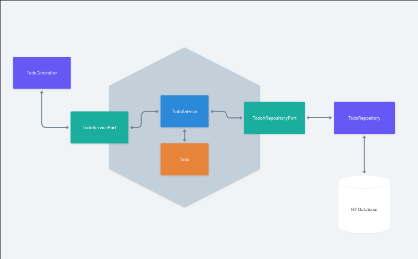

<h1 align="center">
  Arquitetura Hexagonal
</h1>

 
 

### Aplicação simples de um Todo List com arquitetura hexagonal, desenvolvida com Java 17 e Spring Boot. 
O objetivo principal deste projeto é estudar sobre arquitetura hexagonal e implementar em um cenário prático no mundo real.

## Tecnologias usadas:
* Java 17
* Spring Boot 
* Banco de dados H2
* Lombok
* ModelMapper

#### Sinta-se à vontade para explorar o código-fonte, oferecer sugestões e contribuir com o projeto.

## * Modelo Arquitetural

 